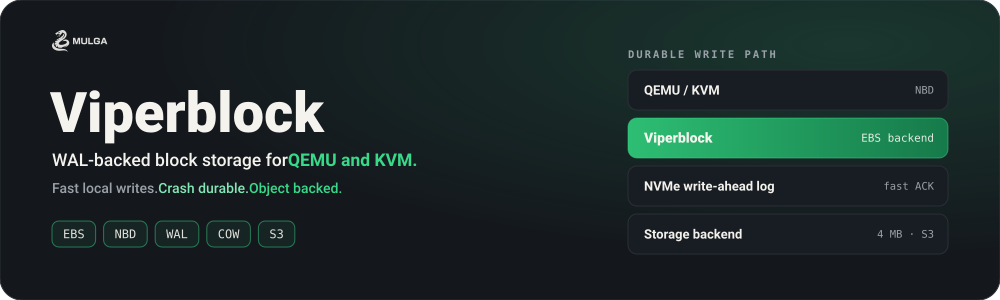
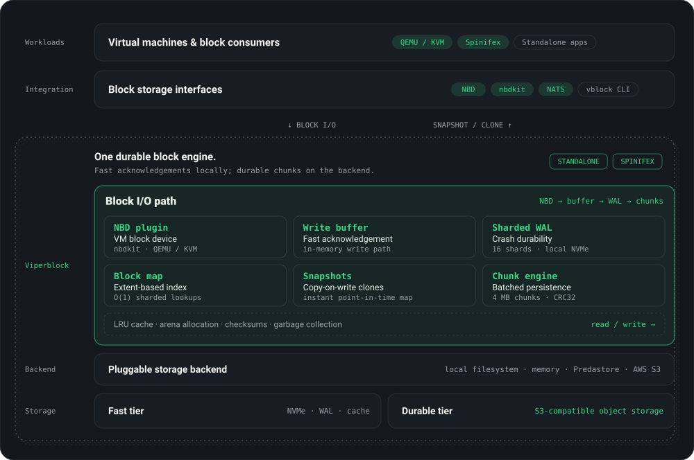

<p align="center">
  
</p>

<p align="center">
  <a href="https://go.dev"></a>
  <a href="LICENSE"></a>
  <a href="https://mulgadc.com"></a>
</p>

<p align="center">
  <a href="#key-features">Key Features</a> ·
  <a href="#architecture">Architecture</a> ·
  <a href="#spinifex-compatible">Spinifex Compatible</a> ·
  <a href="#getting-started">Getting Started</a> ·
  <a href="#usage">Usage</a> ·
  <a href="https://docs.mulgadc.com">Docs</a>
</p>

---

# Viperblock: WAL-backed block storage for QEMU and KVM

Viperblock developed by [Mulga Defense Corporation](https://mulgadc.com/) is a High-performance, WAL-backed block storage engine. Viperblock is the **EBS backend for [Spinifex](https://github.com/mulgadc/spinifex)**, providing durable block volumes for QEMU/KVM virtual machines over the NBD protocol.

Viperblock combines an in-memory write buffer for fast acknowledgment, a write-ahead log on local NVMe for crash durability, and batched 4 MB chunk uploads to pluggable storage backends including S3-compatible object stores. Volumes are exposed as network block devices via an [nbdkit](https://gitlab.com/nbdkit/nbdkit) plugin, giving guest VMs a standard block device backed by durable, distributed storage.

For full architectural details, binary formats, and data flow diagrams, see **[DESIGN.md](DESIGN.md)**.

## Key Features

- **WAL-backed durability** — writes are acknowledged from memory, flushed to a write-ahead log on fast local storage, then consolidated into 4 MB chunks on the backend
- **Sharded WAL** — 16 independent WAL shards eliminate write lock contention across concurrent block writes
- **Extent-based block mapping** — inspired by ext4 extents, consecutive blocks are merged into single index entries for efficient lookups
- **O(1) block lookups** — 16-way sharded `UnifiedBlockStore` tracks every block's lifecycle state with per-shard locking
- **Snapshots and clones** — point-in-time snapshots with copy-on-write clone support (no data duplication)
- **Pluggable backends** — local filesystem, in-memory (testing), or S3-compatible storage ([Predastore](https://github.com/mulgadc/predastore), AWS S3)
- **NBD integration** — nbdkit plugin exposes volumes as network block devices for QEMU/KVM
- **LRU caching** — configurable cache sized by block count or system memory percentage
- **Arena allocator** — bump-pointer allocator with 4 MB slabs reduces GC pressure on the write path

## Architecture

<p align="center">
  
</p>

See [DESIGN.md](DESIGN.md) for detailed write path, read path, WAL format, chunk format, and block mapping internals.

## Spinifex Compatible

Viperblock is one of four components in the [Spinifex](https://github.com/mulgadc/spinifex) AWS-compatible infrastructure platform:

| Component | Role | Repository |
|-----------|------|------------|
| **[Spinifex](https://github.com/mulgadc/spinifex)** | VM orchestration (EC2-compatible) | [mulgadc/spinifex](https://github.com/mulgadc/spinifex) |
| **Viperblock** | Block storage (EBS-compatible) | [mulgadc/viperblock](https://github.com/mulgadc/viperblock) |
| **[Predastore](https://github.com/mulgadc/predastore)** | Object storage (S3-compatible) | [mulgadc/predastore](https://github.com/mulgadc/predastore) |
| **[Northstar](https://github.com/mulgadc/northstar)** | Authoritative DNS (Route53-compatible) | [mulgadc/northstar](https://github.com/mulgadc/northstar) |

When deployed with Spinifex, Viperblock subscribes to NATS topics (`ebs.createvolume`, `ebs.mount`, `ebs.attachvolume`, etc.) for EBS-compatible volume lifecycle management. The Spinifex daemon sends a mount request; Viperblock starts nbdkit and returns an NBD URI that QEMU uses to back a virtual disk.

Viperblock can also be used standalone for any application that needs durable block storage with S3 as a backend tier.

## Getting Started

### Dependencies

```bash
sudo apt install nbdkit nbdkit-plugin-dev
```

### Build

```bash
git clone https://github.com/mulgadc/viperblock.git
cd viperblock
make build
```

This produces:
- `./bin/sfs` — Simple File System demo
- `./bin/vblock` — Volume management CLI
- `./lib/nbdkit-viperblock-plugin.so` — NBD plugin for nbdkit

### Run Tests

```bash
make test        # Unit tests
make preflight   # Full CI checks (format, vet, security, tests, race detector)
```

## Usage

### NBD (Production)

Viperblock volumes are served to QEMU/KVM via nbdkit. When used with Spinifex, this is managed automatically via NATS. For standalone use:

```bash
nbdkit --filter=blocksize ./lib/nbdkit-viperblock-plugin.so \
    volume=my-volume \
    size=$((10*1024*1024*1024)) \
    base_dir=/data/viperblock \
    cache_size=20
```

Plugin parameters:

| Parameter | Description |
|-----------|-------------|
| `size` | Volume size in bytes |
| `volume` | Volume name |
| `base_dir` | Local storage directory (file backend) |
| `bucket` | S3 bucket (S3 backend) |
| `host` | S3 endpoint URL (S3 backend) |
| `region` | AWS region (S3 backend) |
| `access_key` / `secret_key` | S3 credentials (S3 backend) |
| `cache_size` | LRU cache as percentage of system memory |
| `shardwal` | Enable sharded WAL (`true`/`false`) |
| `gc_enabled` | Enable chunk garbage collection (`true`/`false`, default `false`) |

### SFS Demo

The Simple File System (SFS) demo demonstrates Viperblock with a simulated filesystem:

```bash
# File backend (development)
./bin/sfs -btype file -dir /path/to/data -vol my-volume -voldata /tmp/vb

# S3 backend (with Predastore or AWS S3)
AWS_HOST="https://localhost:8443/" \
AWS_BUCKET="viperblock" \
AWS_ACCESS_KEY="EXAMPLEKEY" \
AWS_SECRET_KEY="EXAMPLEKEY" \
./bin/sfs -btype s3 -dir /path/to/data -vol my-volume -voldata /tmp/vb
```

### SFS Options

| Flag | Description | Default |
|------|-------------|---------|
| `-btype` | Backend type: `file`, `memory`, `s3` | `file` |
| `-vol` | Volume name | |
| `-size` | Volume size in bytes | 524288 |
| `-dir` | Directory to read into volume | |
| `-voldata` | Local directory for volume data | |
| `-createvol` | Initialize a new volume | |
| `-vbstate` | Viperblock state file path | |
| `-sfsstate` | SFS state file path | |

## Design Decisions

A summary of the key design choices. See [DESIGN.md](DESIGN.md) for the full treatment.

**WAL on fast local storage, chunks on S3.** Writes are acknowledged from memory and durably flushed to a local WAL (NVMe recommended). WAL entries are then consolidated into 4 MB chunks and uploaded to the backend. This separates write latency (local NVMe speed) from storage durability (S3 replication).

**Extent-based block mapping.** Rather than one index entry per 4 KB block, consecutive blocks are merged into extents (inspired by ext4). A 10-block sequential write produces one extent entry instead of ten, reducing memory usage and speeding up lookups.

**16-way sharded locking.** Both the `UnifiedBlockStore` and the sharded WAL use 16 shards keyed by `blockNum & 0xF`. Concurrent writes to different blocks never contend on the same lock.

**Copy-on-write snapshots.** `CreateSnapshot` freezes the block-to-object mapping without copying any data. Clones created from a snapshot read unmodified blocks from the source volume's chunks and only allocate new storage for blocks that are overwritten. This makes snapshot creation instant and clone creation near-instant regardless of volume size.

**CRC32 checksums everywhere.** Every WAL record includes a CRC32 checksum validated during replay and consolidation. Corrupt records are detected before they reach chunk storage.

## Research

The following papers informed the design of Viperblock:

- Hajkazemi, M. H. et al. "Beating the I/O bottleneck: a case for log-structured virtual disks." *EuroSys 2022.* https://doi.org/10.1145/3492321.3524271
- Zhou, D. et al. "Enabling high-performance and secure userspace NVM file systems with the trio architecture." *SOSP 2023.* https://doi.org/10.1145/3600006.3613171
- Li, H. et al. "Ursa: Hybrid block storage for cloud-scale virtual disks." *EuroSys 2019.* https://doi.org/10.1145/3302424.3303967

## License

Viperblock is licensed under the GNU Affero General Public License v3.0 (AGPLv3). See [LICENSE](LICENSE) for the full text.
